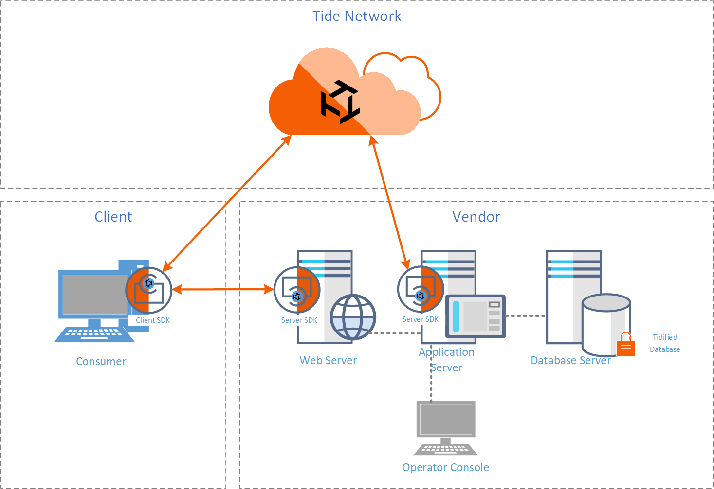

# High Level

### Terminology

Below are terms that are important to understand within the context of the Tide Protocol.  
**Vendor** - Any consumer-facing organization or business that collects, manages and stores consumer data.
**Consumer** - Any individual natural person that has a uniquely identified representation or data footprint (usually in the form of a user account or identity) in a Vendor's database.  
**Smart Contract** - a computer protocol intended to digitally facilitate, verify, or enforce the negotiation or performance of a contract.  
**ORK** - Orchestrated Recluder of Keys - The Tide Protocol decentralized nodes  
**Key Pair** - consist of a Secret Key (SK) and Public Key (PK)

